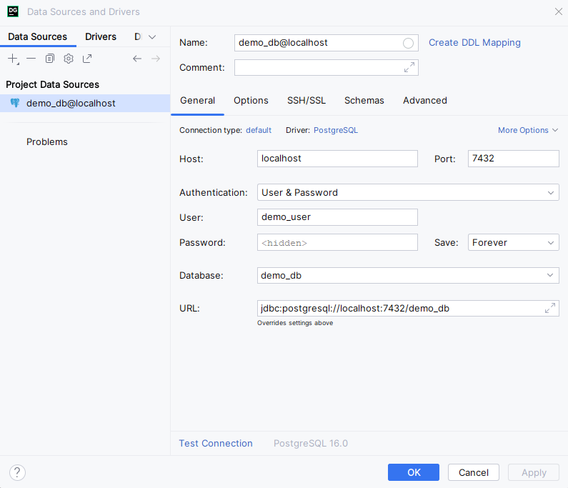
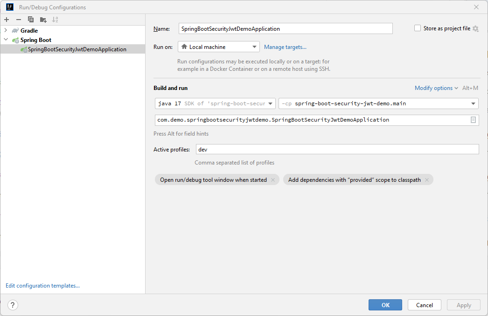
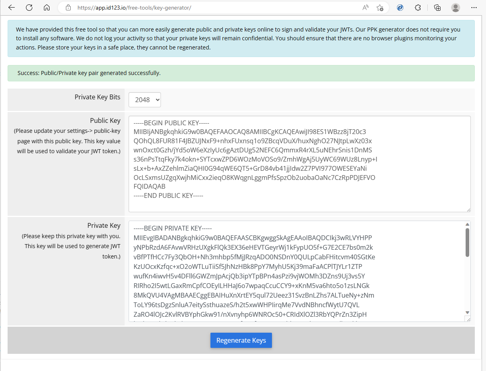
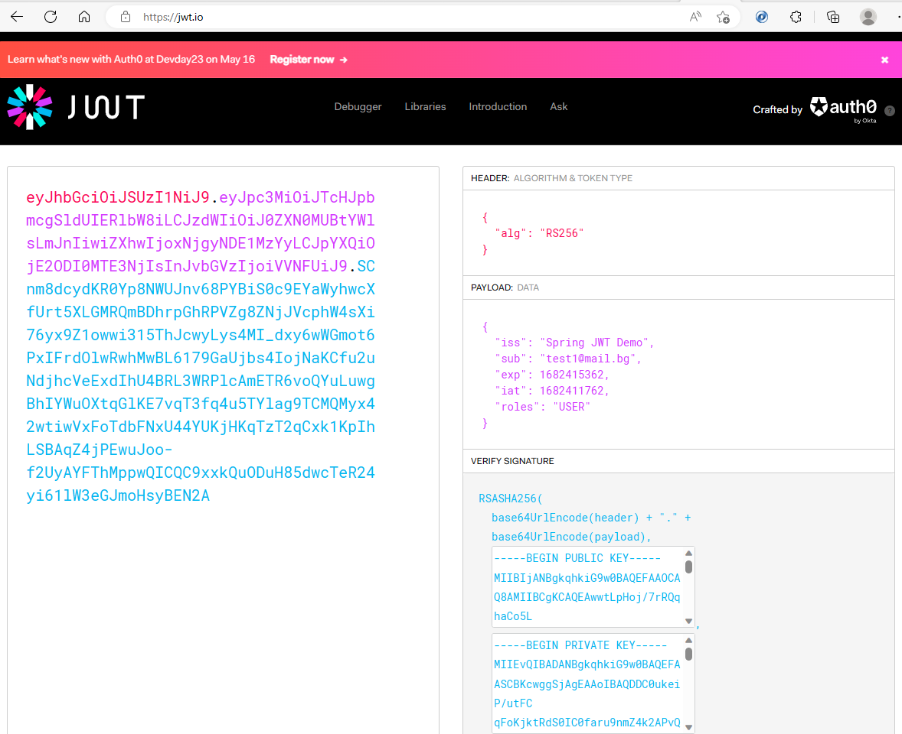
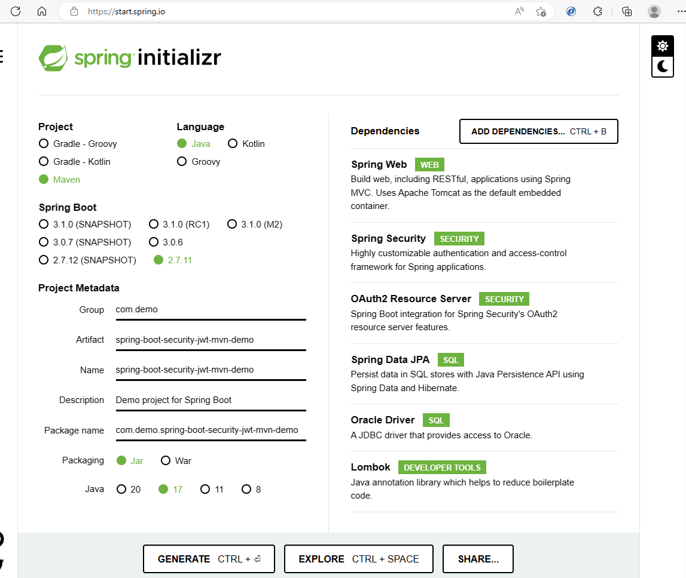

# Spring Boot JWT Demo

- Swagger URL: http://localhost:9090/swagger-ui/index.html

## Run current project

### Checkout current project
``` 
git clone https://github.com/stuckata/spring-boot-security-jwt-demo.git 
```

### Run DB (using docker-compose)
``` 
docker compose up -d 
```

### Connect to the DB (using some DB tool like DBeaver or DataGrip)
```properties
url=jdbc:oracle:thin:@localhost:1521:XE
user=system
pwd=oracle
```
DataGrip Example:


### Init DB (execute initial scripts)
Run the SQL scripts, located under ```/src/main/resources/db/oracle``` in the order they appear.

1). Init db - [V0.0.1.20230424.1809.00359__init_db.sql](src%2Fmain%2Fresources%2Fdb%2Foracle%2FV0.0.1.20230424.1809.00359__init_db.sql)

2). Create tables - [V0.0.1.20230424.1809.26326__create_table_users.sql](src%2Fmain%2Fresources%2Fdb%2Foracle%2FV0.0.1.20230424.1809.26326__create_table_users.sql)

### Change application.properties (if needed)

You can see different settings there, that can be modified.
[application.properties](src%2Fmain%2Fresources%2Fapplication.properties)

### Change application-dev.properties (if needed) 

You can see different settings there, that can be modified.
[application-dev.properties](src%2Fmain%2Fresources%2Fapplication-dev.properties)

### Select "dev" Spring profile to run the example

IntelliJ IDEA:


### Generate *YOUR OWN* Public-Private Key Pair
1). You can use some free online tool like this one:
https://app.id123.io/free-tools/key-generator/



2). Copy & Paste generated values to: ```/src/main/resources/keys```

- Public Key: [app.pub](src%2Fmain%2Fresources%2Fkeys%2Fapp.pub)
- Private Key: [app.key](src%2Fmain%2Fresources%2Fkeys%2Fapp.key)

### Run the Demo (with you IDE)

### Open Swagger UI
 > http://localhost:9090/swagger-ui/index.html

## Implementation Explained


## Useful Commands & Links
### Decode JWT
Go to https://jwt.io/



### Kill process, listening on specific port

```
> netstat -ano | findstr :1521

> taskkill /PID <PID> /F
```

### Create NEW Project

Use this steps to create a new project.

#### Generate Spring Boot project

1). Go to ["Spring Initializr"](https://start.spring.io/)

2). Select whatever you need

3). Add the dependencies you need

4). Generate Project


5). Unzip and open with some IDE

#### Add project to GIT

```
echo "# spring-boot-security-jwt-demo" >> README.md
git init
git add README.md
git commit -m "first commit"
git branch -M main
git remote add origin https://github.com/stuckata/spring-boot-security-jwt-demo.git
git push -u origin main
```